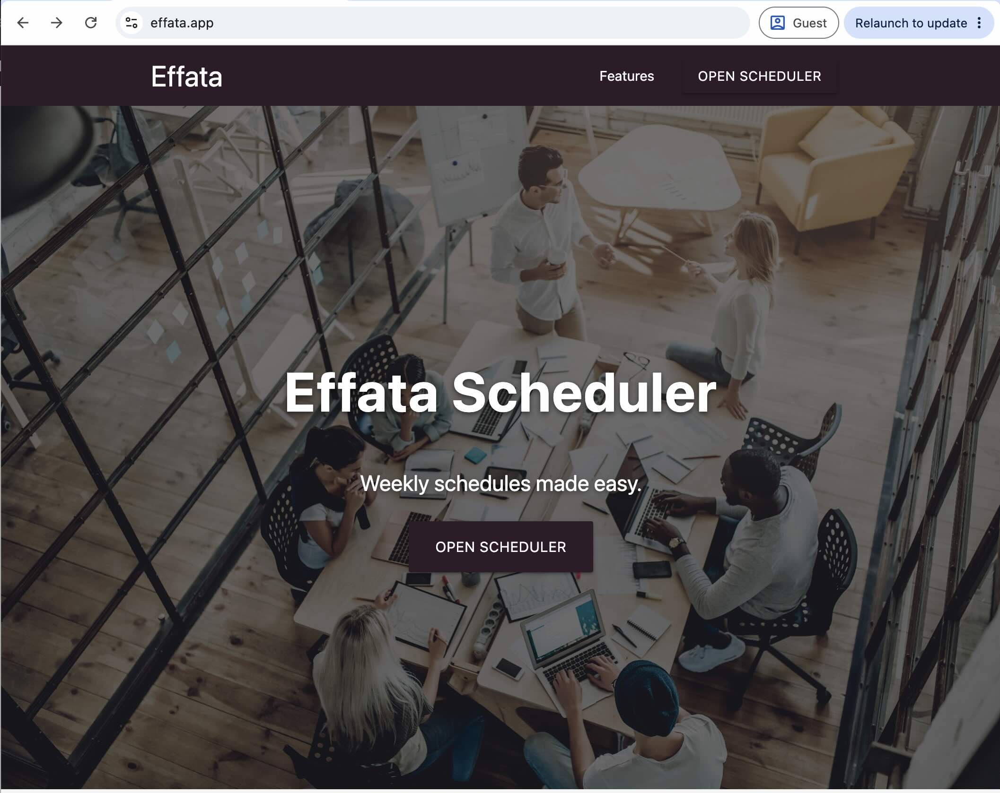
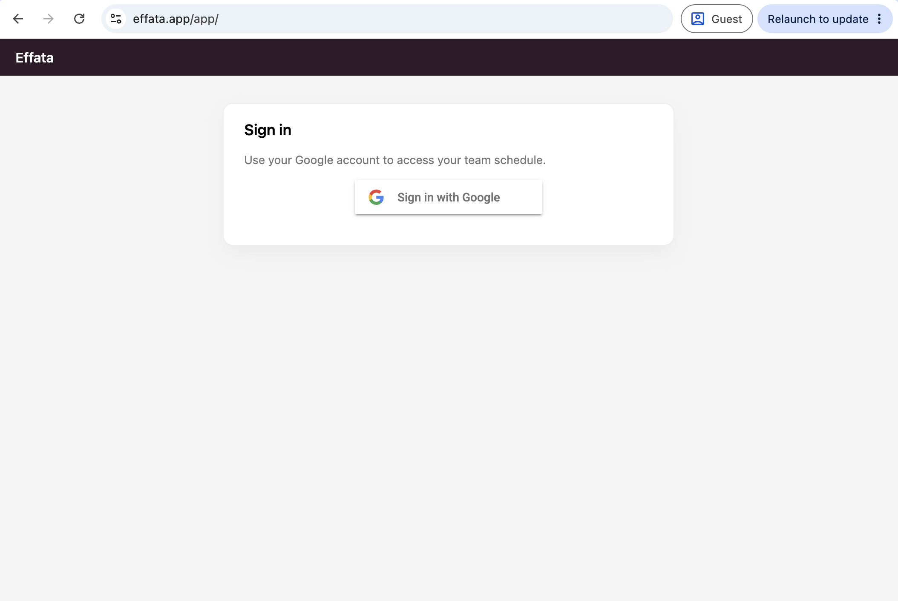
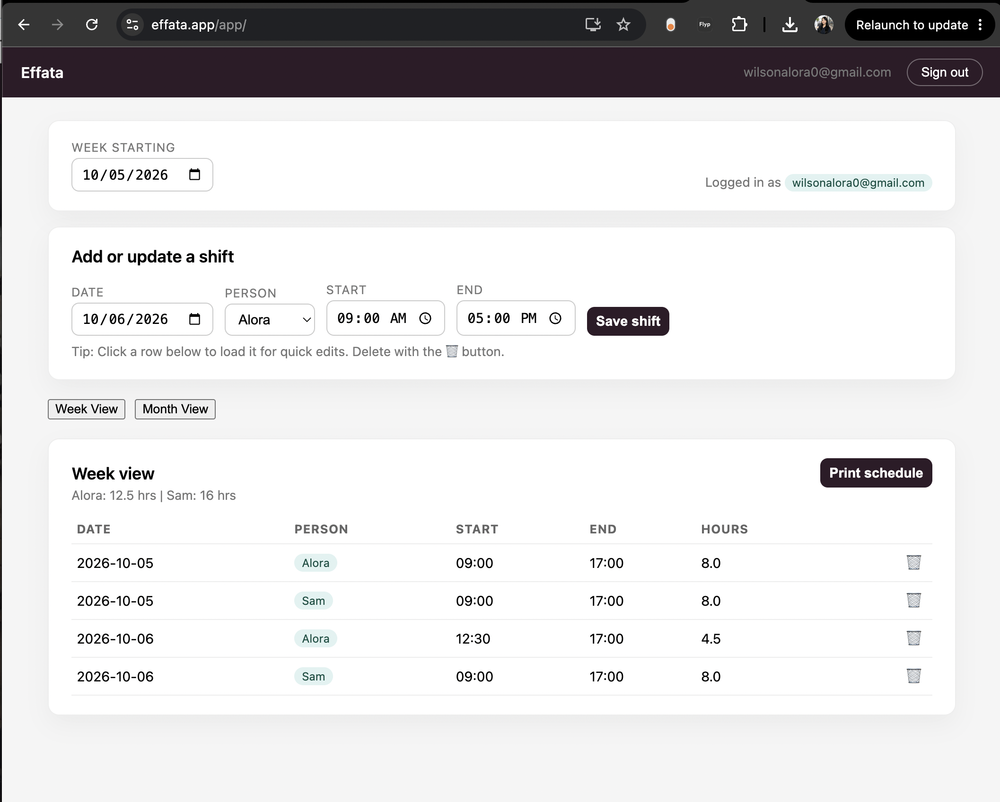
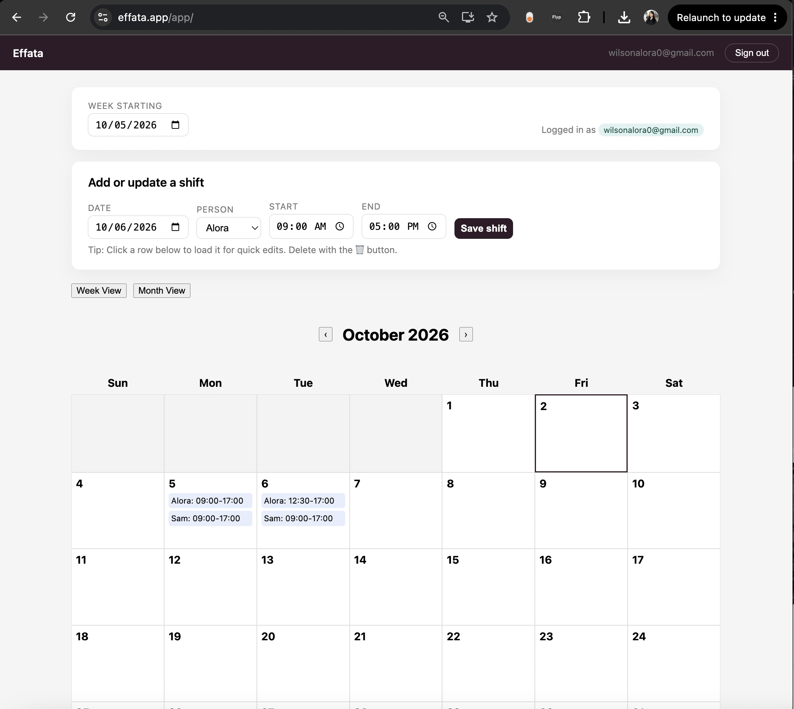

# Effata Scheduler

**Live Application:** https://effata.app

Effata Scheduler is a web-based employee scheduling application designed to simplify the creation and management of team work schedules. The application provides authenticated users with tools to create, edit, and manage employee shifts through responsive weekly and monthly scheduling views.

I developed Effata Scheduler while cross-training with the MIS Development team at MCCS Okinawa as a practical solution for managing a small team's schedule.

## Key Features

- Secure user authentication with Firebase Authentication
- Authorized user access control for the scheduling system
- Create, edit, and delete employee shifts
- Weekly and monthly schedule views
- Employee and shift management
- Cloud-based schedule storage using Firestore
- Responsive interface for desktop and mobile devices
- Progressive Web App (PWA) functionality

## Technologies Used

- **HTML5 & CSS3** — application structure and responsive interface
- **JavaScript & jQuery** — application logic and user interactions
- **Firebase Authentication** — user authentication
- **Cloud Firestore** — employee and scheduling data storage
- **Firebase Hosting** — deployment and hosting
- **FirebaseUI** — authentication interface
- **Progressive Web App (PWA)** — manifest and service worker support
- **Git & GitHub** — version control and project documentation

## Project Background

Effata Scheduler was developed while I was cross-training with the MIS Development team at MCCS Okinawa. The project gave me an opportunity to apply software development concepts to a practical workplace scheduling need.

The goal was to create a simple scheduling tool that allowed a small team to maintain a shared schedule without relying on manually updated documents or disconnected scheduling information. I designed and developed the application to provide a centralized interface where authorized users could view schedules and manage shift information.

Building the application gave me hands-on experience working with authentication, cloud-hosted data, CRUD operations, responsive interface design, and application deployment.

## Application Screenshots

### Landing Page

### Google Authentication

### Weekly Schedule View

### Monthly Schedule View

